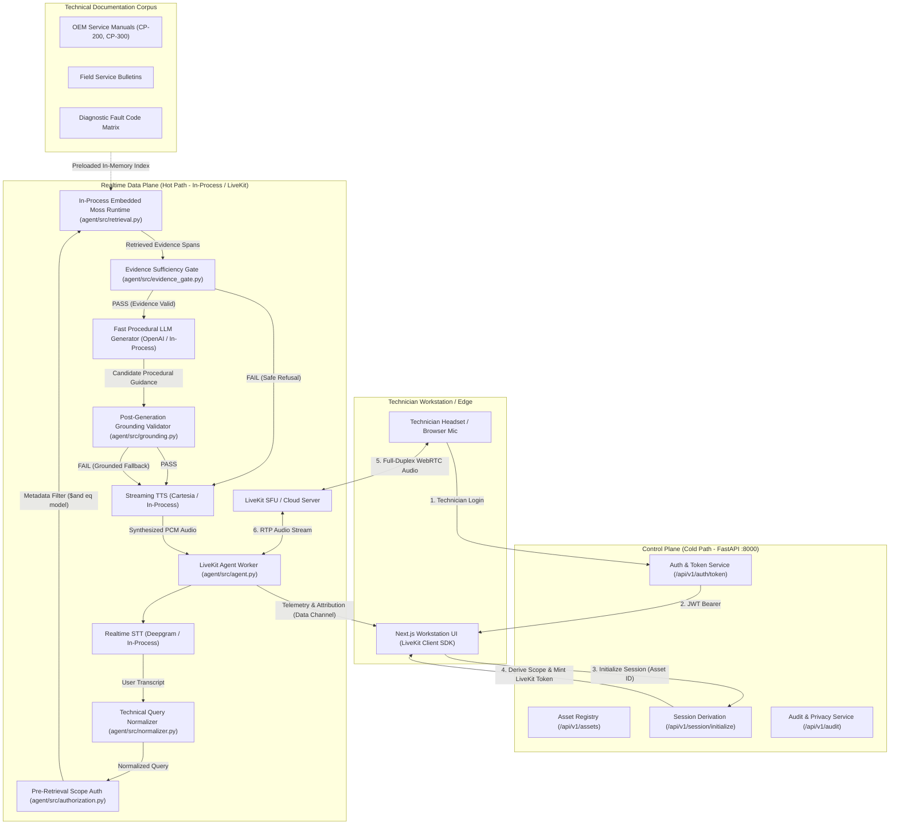

# FieldOps Voice Copilot — Architecture Specification

> **Submission for YC Fall 2026 × Moss — The Zero Latency Builder Sprint**  
> **Track**: Real-Time Voice and Conversational AI  
> **Repository**: [viswanthanss/fieldops-voice-copilot](https://github.com/viswanthanss/fieldops-voice-copilot)

---

## 1. System Overview

FieldOps Voice Copilot is an **evidence-gated low-latency realtime voice AI** designed for industrial field technicians servicing mission-critical equipment (such as commercial HVAC chillers, industrial compressors, and VFD drives).

Unlike conventional voice assistants that naively pipe speech transcripts directly to large language models (resulting in hallucinated torque specs, wrong model cross-contamination, and high audio latency), FieldOps Voice Copilot enforces a **deterministic, fail-closed safety pipeline**:

1. **Server-Derived Pre-Retrieval Authorization**: Scope is bound by technician work order and equipment model before any retrieval occurs. Technician speech cannot expand access.
2. **In-Process Embedded Moss Runtime**: Technical service manuals, error code books, and engineering service bulletins are preloaded directly into agent process memory for sub-10ms metadata-filtered retrieval without cloud round-trips.
3. **Deterministic Evidence Sufficiency Gate**: Executed BEFORE procedural LLM guidance. Verifies token overlap, equipment model match, document revision lifecycle, and citation sufficiency. If insufficient, fails fast with safe audible refusal before spending LLM generation tokens.
4. **Post-Generation Grounding Validator**: Independent post-pass verifying every assertion against retrieved evidence spans before speech synthesis.

---

## 2. Realtime Data Plane (Hot Path) vs Control Plane (Cold Path)

The system strictly decouples the high-speed realtime audio streaming loop from the control and administrative plane:



---

## 3. Core Architectural Invariants

| Invariant | Implementation Mechanism | Violation Consequence |
|---|---|---|
| **Pre-Retrieval Authorization** | `agent/src/authorization.py` generates Moss metadata filters using server-derived session scope (`{"$and": [{"field": "model", "condition": {"$eq": asset_model}}]}`). | Unauthorized cross-tenant or unassigned equipment data cannot enter the retrieval pool. |
| **No User Auth Expansion** | User speech transcripts are strictly forbidden from overriding JWT-derived claims (`authorized_models`, `cert_level`). | Prompt injection cannot bypass equipment clearance. |
| **Fail-Closed Retrieval** | When session context or credentials are missing/invalid, system immediately returns empty retrieval or safe refusal. | System never "defaults to open" or guesses specs. |
| **Pre-LLM Evidence Gate** | `agent/src/evidence_gate.py` checks query token overlap, equipment model verification, revision staleness, and span count. | Saves 600ms+ LLM latency and prevents hallucinations when documentation is lacking. |
| **Untrusted Data Boundary** | Retrieved technical documents are treated as untrusted data and wrapped in `[RETRIEVED TECHNICAL EVIDENCE RULES]` delimiters. | Prompt injection payloads hidden within manuals cannot hijack agent behavior. |
| **Post-Generation Grounding** | `agent/src/grounding.py` verifies all generated numerical/procedural claims against retrieved evidence spans before TTS audio output. | Hallucinated torque values or wiring steps are blocked before the technician hears them. |

---

## 4. Latency Budget & Breakdown

The architecture is explicitly designed for the sub-second conversational loop:

```
[Audio In] ──► [STT / VAD] ──► [Normalize] ──► [Scope Auth] ──► [Moss Retrieval] ──► [Evidence Gate] ──► [LLM TTFT] ──► [Grounding] ──► [TTS TTFB] ──► [Audio Out]
               ~150ms          ~0.2ms          ~0.1ms          ~7.4ms (Ref)         ~0.5ms              ~350ms          ~50ms             ~120ms
```

- **Local In-Process Pre-LLM CPU Overhead**: **< 1.0 ms P95** (Measured: 0.628 ms P95 across 108 benchmark queries).
- **Moss Embedded In-Process Retrieval**: Reference target **< 10.0 ms P95** (Published Moss reference: 7.4 ms P95).
- **End-to-End Voice Turn Target**: **< 1,200 ms P95**.

---

## 5. Security & Privacy Posture

- **OWASP Top 10-Aligned Mitigations**: Mitigates LLM01 (Prompt Injection), LLM02 (Sensitive Information Disclosure), LLM06 (Excessive Agency), and LLM08 (Vector/Retrieval Poisoning).
- **Data Minimization & Ephemeral Audio**: Raw microphone audio streams are processed in-memory via WebRTC RTP and are never persisted to disk. Only turn attribution metadata and operational telemetry are logged.
- **GDPR Article 17 Erasure**: Endpoints provided (`/api/v1/privacy/technician-data`) to permanently purge technician session metadata, feedback, and audit logs.
